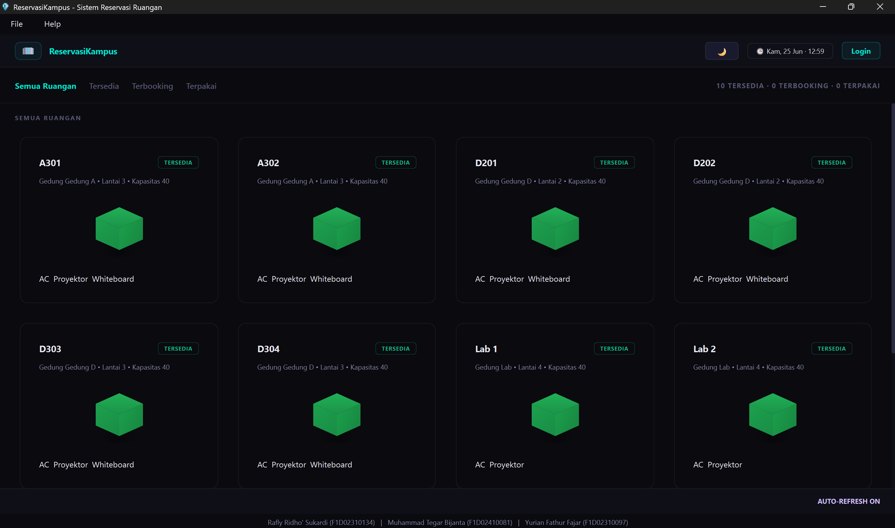
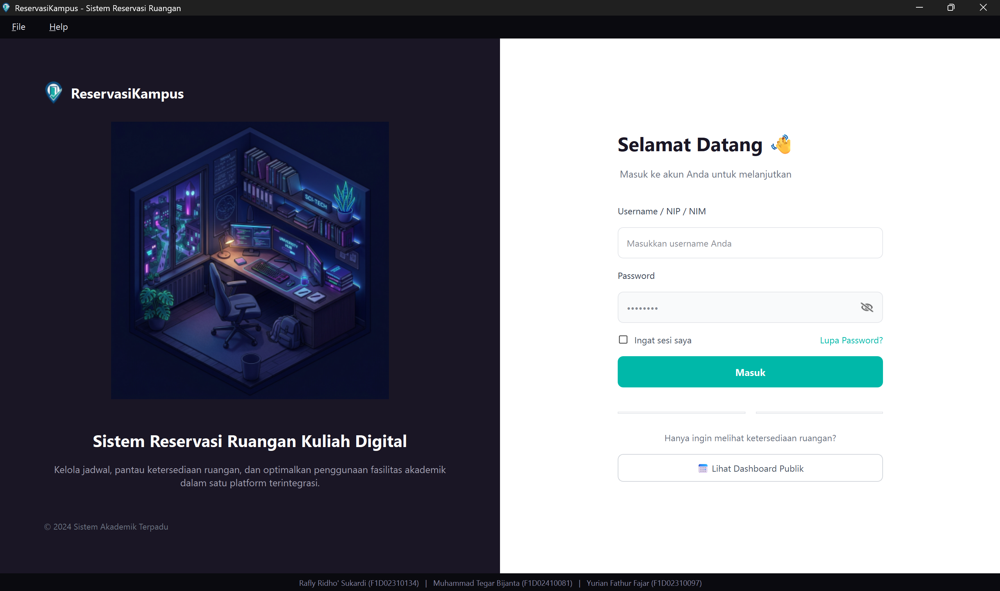
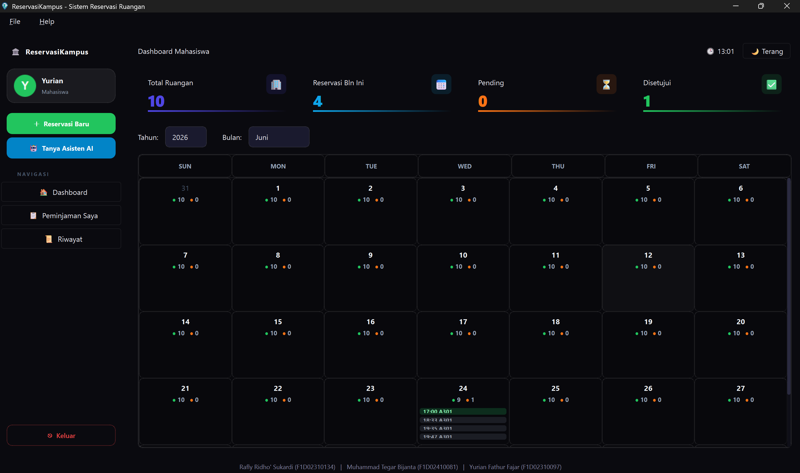
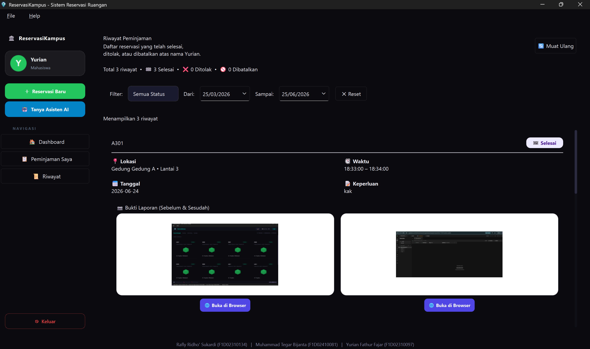
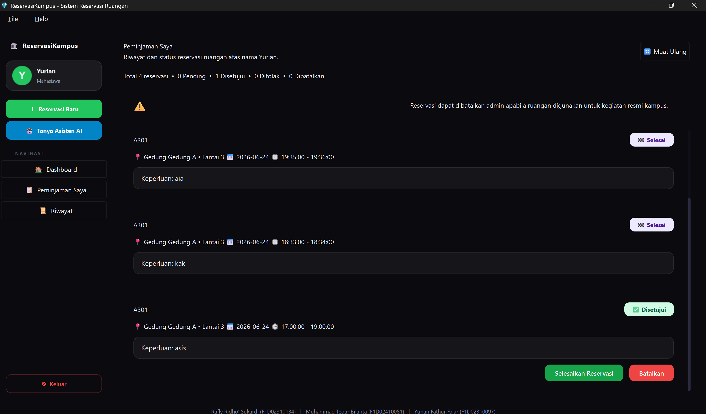
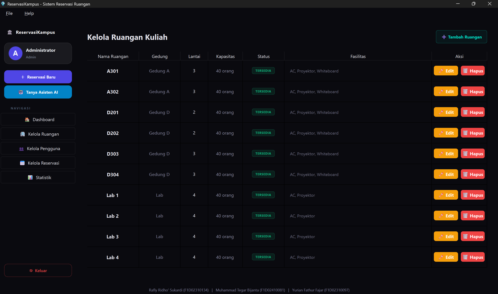
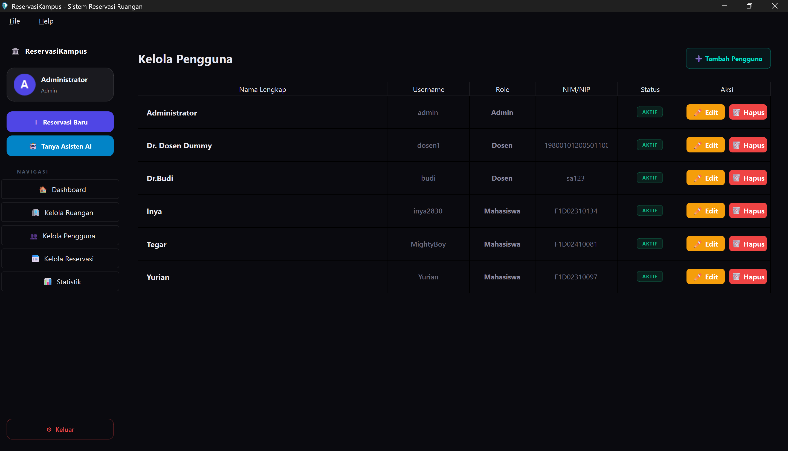
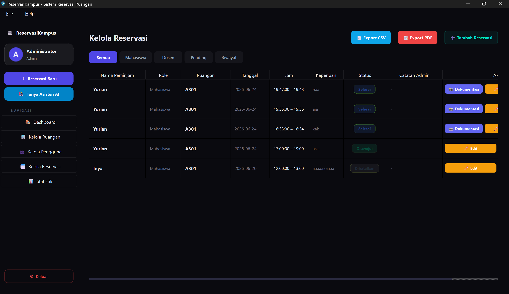
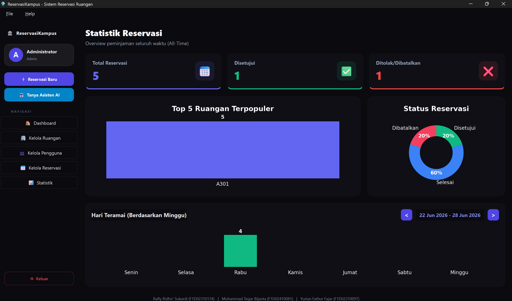

# CRSYS — Sistem Reservasi Ruangan Kuliah

Aplikasi desktop (GUI) berbasis **PySide6** untuk mengelola peminjaman dan
penggunaan ruangan kuliah secara digital. Dibuat sebagai Proyek Akhir mata kuliah
**Pemrograman Visual**.

## Deskripsi Singkat

CRSYS (Campus Room Reservation System) membantu civitas akademika kampus dalam
mengelola peminjaman ruangan kuliah secara terpusat dan real-time. Aplikasi
terhubung ke backend cloud **Supabase** (PostgreSQL) sebagai basis data utama,
dengan autentikasi berbasis **bcrypt** dan sistem multi-role untuk membedakan hak
akses Admin, Dosen, dan Mahasiswa.

## Anggota Kelompok

| Nama | NIM |
|------|-----|
| Rafly Ridho' Sukardi | F1D02310134 |
| Yurian Fathur Fajar | F1D02310097 |
| Muhammad Tegar Bijanta | F1D02410081 |

## Fitur Utama

- **Multi-role**: Admin (kelola ruangan, pengguna, reservasi, statistik), Dosen,
  dan Mahasiswa dengan hak akses masing-masing.
- **Dashboard Publik**: status ketersediaan seluruh ruangan secara real-time tanpa
  perlu login, dengan auto-refresh setiap 10 detik.
- **Reservasi Ruangan**: form pemilihan ruangan, tanggal, dan jam dengan validasi
  bentrok jadwal otomatis secara real-time.
- **Slot Waktu Berbasis Role**: Dosen hanya dapat memesan pukul 07.00–17.00,
  Mahasiswa pukul 17.00–21.00, sehingga tidak terjadi bentrok antar role.
- **Kelola Reservasi (Admin)**: setujui/tolak reservasi, ekspor data ke **CSV &
  PDF**, serta lihat foto dokumentasi ruangan.
- **Upload Foto Dokumentasi**: foto sebelum dan sesudah pemakaian ruangan diunggah
  ke Supabase Storage.
- **Statistik Visual**: grafik batang, pie chart, dan grafik hari menggunakan
  matplotlib yang di-render langsung di PySide6.
- **Chatbot AI**: asisten virtual untuk mahasiswa yang berjalan asinkron via
  QThread agar antarmuka tidak freeze.
- **Tema Gelap/Terang**: toggle mode kapan saja melalui tombol di header,
  menggunakan file stylesheet `.qss` secara global.

## Struktur Folder

```
pv26-finalproject-jadwalruangan/
├── main.py             
├── requirements.txt
├── assets/              
├── api/
│   └── supabase.py      
├── ui/
│   ├── index.py         
│   ├── login_page.py    
│   ├── admin/          
│   ├── mahasiswa/       
│   └── dosen/          
└── utils/               
```

## Cara Menjalankan

1. (Opsional) buat virtual environment:
   ```bash
   python -m venv venv
   venv\Scripts\activate        # Windows
   source venv/bin/activate     # Linux/Mac
   ```
2. Pasang dependensi:
   ```bash
   pip install -r requirements.txt
   ```
3. Jalankan aplikasi:
   ```bash
   python main.py
   ```

Koneksi ke Supabase dikonfigurasi di `api/supabase.py`. Pastikan kredensial
Supabase sudah diatur sebelum menjalankan aplikasi.

### Akun Demo

| Peran | Username | Password |
|-------|----------|----------|
| Admin | `admin` | *(sesuai data di Supabase)* |
| Dosen | `dosen1` | *(sesuai data di Supabase)* |
| Mahasiswa | `mahasiswa1` | *(sesuai data di Supabase)* |

## Screenshot

**Dashboard Publik (Tanpa Login)**



**Halaman Login**



**Dashboard Sesudah Login**



**Menu Peminjaman Pengguna**



**Riwayat Reservasi**



**Kelola Ruangan (Admin)**



**Kelola Pengguna (Admin)**



**Kelola Reservasi (Admin)**



**Statistik (Admin)**



## Pembagian Tugas

### Anggota 1 — Rafly (Rafly Ridho' Sukardi) — Ketua
**Fokus: Inisialisasi & Dashboard**  
File: `api/supabase.py`, `ui/index.py`, `ui/admin/dashboard.py`,
`ui/mahasiswa/dashboard.py`, `ui/dosen/dashboard.py`  
Tugas:
- Inisialisasi database di Supabase & setup skema awal
- Setup awal CRUD Admin (ruangan & pengguna)
- Dashboard Admin, Mahasiswa, Dosen, dan Dashboard Publik

### Anggota 2 — Yurian (Yurian Fathur Fajar)
**Fokus: Dokumentasi, Laporan & UI**  
File: `utils/export.py`, `ui/admin/foto/foto_dokumentasi_widget.py`,
`ui/admin/reservasi/kelola_reservasi.py`, `ui/login_page.py`  
Tugas:
- Fitur upload foto dokumentasi (sebelum & sesudah pemakaian)
- Ekspor laporan CSV & PDF dari halaman Kelola Reservasi
- Edit reservasi oleh Admin
- Perbaikan halaman login serta pembuatan logo dan ikon aplikasi
- Berbagai perbaikan UI dan logika di halaman lain

### Anggota 3 — Tegar (Muhammad Tegar Bijanta)
**Fokus: Reservasi & Riwayat Mahasiswa**  
File: `ui/mahasiswa/peminjaman/reservasi_mahasiswa.py`,
`ui/mahasiswa/peminjaman/dialog_reservasi.py`,
`ui/mahasiswa/riwayat/riwayat_peminjaman.py`  
Tugas:
- Fitur peminjaman ruangan sisi Mahasiswa
- Halaman riwayat peminjaman beserta filter status dan tanggal
- Pembuatan file `requirements.txt` dan dokumentasi dependensi proyek

## Teknologi

- Python 3 + **PySide6**
- **Supabase** (PostgreSQL cloud) sebagai basis data utama
- **bcrypt** untuk hashing password
- **matplotlib** untuk visualisasi statistik
- **ReportLab** untuk ekspor PDF
- **Pillow** untuk pemrosesan gambar
- **requests** untuk komunikasi dengan Supabase API

## Link Repository

[https://github.com/Ridho2830/pv26-finalproject-jadwalruangan](https://github.com/Ridho2830/pv26-finalproject-jadwalruangan)
